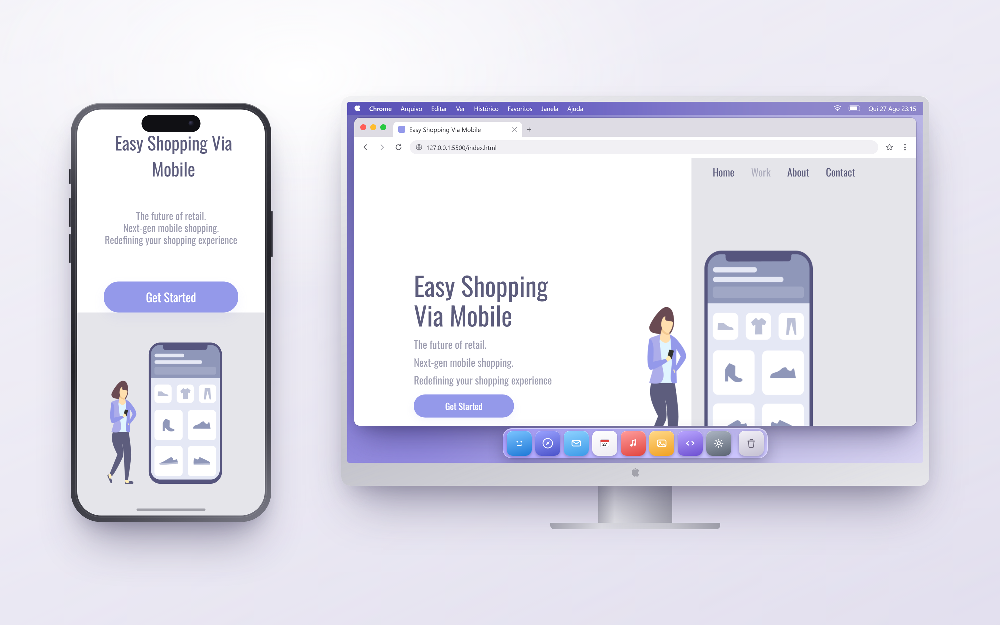

<h1>💥My sales project💥</h1>
 
 
 
<h2> ✌️My project, carried out together with my tutor Rodolfo Mori, at the school. <a href="https://www.devclub.com.br">DevClub</a> ✌️</h2>
 
 
 

 🚀This project used the following technologies. 🚀

 
 
 
 
   
  
 
 
<h3>🛍️ Easy Shopping Via Mobile</h3>
 
 

 
 

This is a landing page project for an e-commerce platform focused on mobile shopping, developed to create a fluid, modern, and fully responsive user experience.

 
<h4>🎯 Project Objective</h4>
 

 The main objective was to build a clean and attractive user interface (UI), simulating the launch of a shopping app. The development focus was on applying good design practices and ensuring that the layout adapts perfectly to different screen sizes (computers and mobile devices).

 
